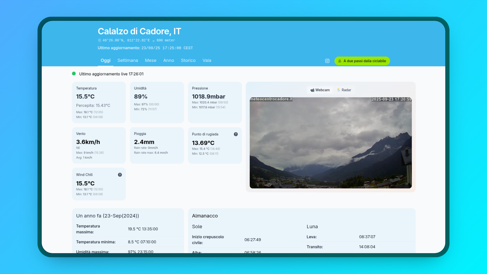

# MCC-sofaskin 

This is a custom WeeWX skin based on [Sofaskin-CW9009](https://github.com/weatherstorm/Sofaskin-CW9009)

Please note that this is not intended for use on your WeeWX instance, since its heavely personalized to match my needs. You're free to do anything you want with it anyway.

Features:

- Header, Footer and the entire homepage completely rewritten using TailwindCSS
- Live data updates using MQTT
- JS interactive plots on homepage

You can see the live version on my website at [meteocentrocadore.it](https://meteocentrocadore.it)

# Credits
Thanks to neoground for the [original Sofaskin](https://neoground.com/projects/sofaskin?lang=en) and to weatherstorm for the awesome [CW90009 version](https://github.com/weatherstorm/Sofaskin-CW9009).

#

THE SOFTWARE IS PROVIDED "AS IS", WITHOUT WARRANTY OF ANY KIND, EXPRESS OR
IMPLIED, INCLUDING BUT NOT LIMITED TO THE WARRANTIES OF MERCHANTABILITY,
FITNESS FOR A PARTICULAR PURPOSE AND NONINFRINGEMENT. IN NO EVENT SHALL THE
AUTHORS OR COPYRIGHT HOLDERS BE LIABLE FOR ANY CLAIM, DAMAGES OR OTHER
LIABILITY, WHETHER IN AN ACTION OF CONTRACT, TORT OR OTHERWISE, ARISING FROM,
OUT OF OR IN CONNECTION WITH THE SOFTWARE OR THE USE OR OTHER DEALINGS IN THE
SOFTWARE.
